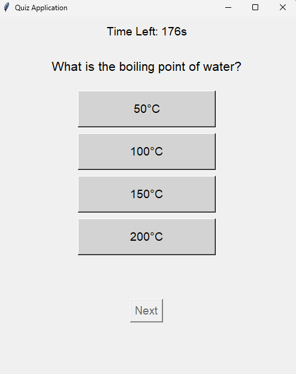
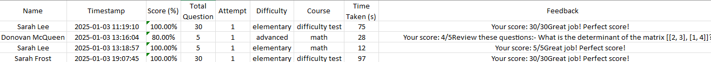

# Quiz-Application
An interactive Python-based quiz app with Tkinter GUI. It supports quizzes by subject or difficulty, tracks user performance (name, score, timestamp, feedback) in Excel, and provides timed tests. Features randomized questions, adjustable timers, and a user-friendly interface for education and learning.
## Table of Contents
- [Introduction](#introduction)
- [Features](#features)
- [Requirements](#requirements)
- [Installation](#installation)
- [Usage](#usage)
- [Screenshots](#screenshots)
- [License](#license)
## Introduction
The Quiz Application is an interactive Python program designed to help users test their knowledge across multiple subjects and difficulty levels. With a user-friendly Tkinter GUI, it tracks performance, records results in an Excel file and provides detailed feedback. This project showcases a practical application of Python programming and GUI development.
## Features
- Multiple Quiz Modes: Take quizzes by subject (math, science, history, reading, music, Spanish) or difficulty (elementary, middle, high, advanced).
- Excel Progress Tracking: Records scores, timestamps, feedback, and attempts in a detailed Excel file (`quiz_progress.xlsx`).
- Randomized Questions: Keeps quizzes fresh by shuffling questions each time.
- Adjustable Timers: 
  - Difficulty test: 3 minutes.
  - Single subject test: 30 seconds.
- Feedback System: Highlights incorrect answers to help users improve.
- Expandable: Easy to add more subjects or difficulty levels.
## Requirements
To run the application, you need:
1. Python 3.7+
2. Excel (to create and view progress files).
3. Visual Studio Code or any compatible Python IDE with the following extensions installed:
   - Python
   - Pylance
   - Python Debugger
   - Python Environment Manager
   - Python Extension Pack
   - Python Indent (optional)
   - Any other recommended Python extensions.
4. Operating System: Compatible with Windows, macOS, and Linux (if Excel or an equivalent tool is available).
## Installation
1. Clone the Repository:
   ```bash
   git clone https://github.com/YourUsername/Quiz-Application.git
## Usage
1. Launch the Application:
   - Open `Quiz.py` in your IDE or run it from the terminal.
2. Choose a Quiz:
   - Select a difficulty level or specific subject from the dropdown menus.
   - Click Start Quiz to begin.
3. Answer Questions:
   - Select an answer by clicking one of the four options.
   - Move to the next question or complete the quiz.
4. Review Results:
   - After completing the quiz, enter your name to save the results.
   - Open the `quiz_progress.xlsx` file to view your performance and feedback.
## Screenshots
  1. Start Screen
    - 
  2. During the Quiz
    - 
  3. Quiz Completion
    - 
  4. Excel Sheet with Results
    - 
## License
This project is licensed under the MIT License. You are free to use, modify, and distribute the software, and you are given proper attribution to the creator.
